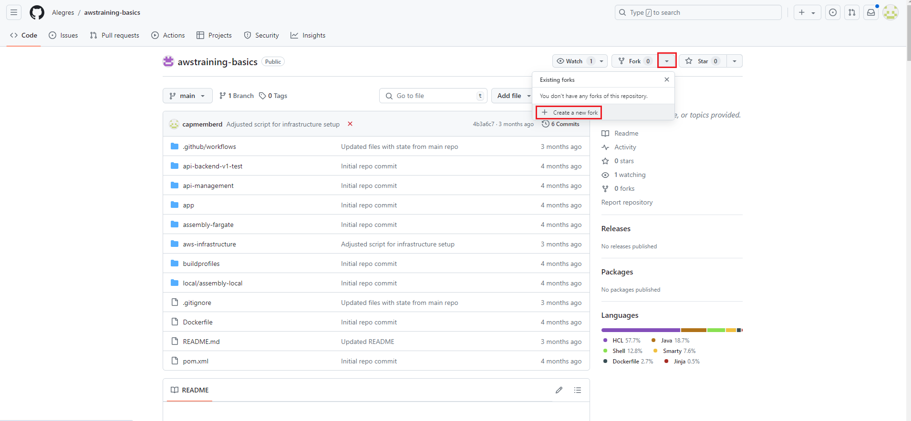
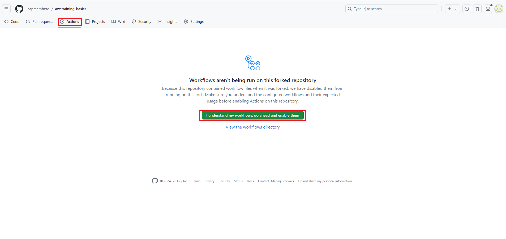
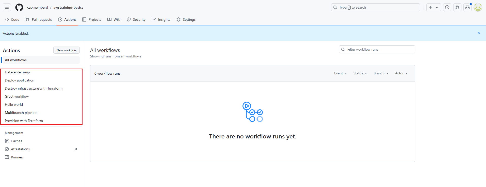
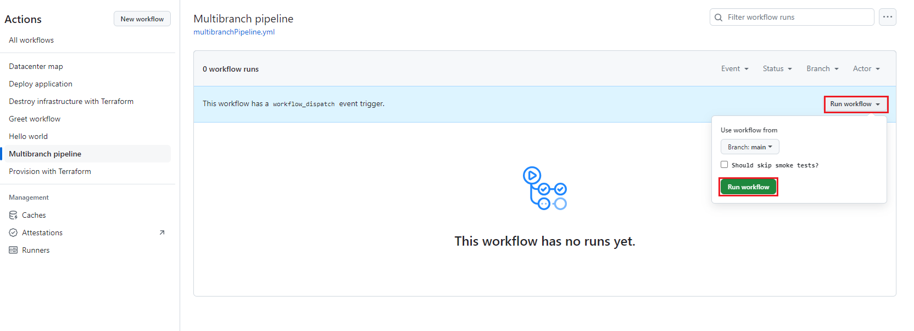

# Introduction to GitHub workflows
The knowledge regarding GitHub workflows can be gained during the AWS CICD GitHub training. This document contains only basic information regarding GitHub workflows.

GitHub workflows allow to execute automated pipelines for our application. Using them you can:
* Deploy infrastructure to AWS
* Destroy infrastructure in AWS
* Build our application and deploy it to AWS

In order to use GitHub workflows, you must first have a GitHub account and then **fork** one of the training repositories to your personal account:

Then, you should go to your forked repository, open "Actions" and enable workflows:

# Preparation
After forking repository to your account, please clone it to your local machine and search for all occurrences of:
* <<ACCOUNT_ID>>

Adjust this placeholder to point to your AWS account, so that the workflows will execute there.

You must also setup secrets in GitHub. First you should go to **GitHub -> Your fork repo -> Settings -> Secrets and variables**
and create two repository secrets:
* BACKEND_EMEA_TEST_AWS_KEY
* BACKEND_EMEA_TEST_AWS_SECRET

and set accordingly **AWS_KEY** and **AWS_SECRET** of your user. The key pair must be first generated for your user in AWS IAM.

By doing this, you make sure that all workflows will execute actions in your AWS account.

# Using workflows
On the left side you can find existing workflows:

For different trainings we will use different workflows.

During AWS Basics we do not use workflows for the application deployment. During AWS Terraform we will setup and destroy the infrastructure using GitHub workflows. In CICD training we will write our own workflows from scratch.

Some workflows are triggered automatically, eg. after commit to branch. However, we can also run workflows manually:

## Explanation of single workflows
* Multibranch pipeline
  * It builds application, runs JUnit tests, builds Docker image, deploys it to TEST environment and eventually runs smoke tests on the running application
  * It requires AWS infrastructure to exist (either must be created manually or using Provision with Terraform)
  * It can be triggered manually, but is also triggered during commit to feature branch / master
* Deploy application
  * It takes image from source ECR, clones it to target ECR and deploys new task definition in the target environment; it allows deployments between different environments, eg. TEST -> E2E
  * It requires AWS infrastructure to exist first for both source and target environments
* Provision with Terraform
  * It creates AWS infrastructure using Terraform
* Destroy infrastructure with Terraform
  * It destroys AWS infrastructure using Terraform

# Potential issues
* Multibranch pipeline will not work if secrets are not configured in your forked repository and if respective placeholders are not updated in code
* Multibranch pipeline will not work if no infrastructure already exists in your AWS account
* If you commit some code to your master branch, multibranch pipeline will execute automatically. It can fail if no other prerequisites are fulfilled. This is a normal behavior, eg. when no AWS infrastructure was provisioned.
* During AWS Basics we do not deploy the application using workflows - we do it manually.